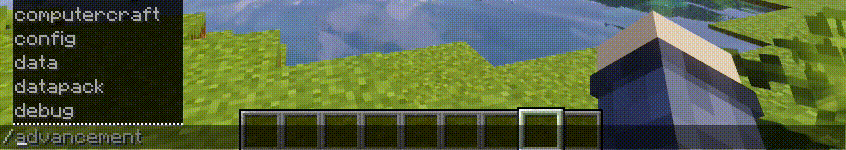

# SuggestionProviderFabric

A minor change to Minecraft's suggestion provider so that it auto-completes resource locations for all mod namespaces. 

Whilst this is a very tiny change, if you use commands a lot in modded it is likely to save you a lot of time.

Note that this mod does not need to be installed on a dedicated server to work, though doing so is advisable so that the client and server mod list match. 

## Example
For example, let's say you want to use `/give` to spawn yourself an `oak_seed` from Dynamic Trees. With vanilla, you may begin to type `/give @p oak_seed` and no auto-complete suggestions will come up, as it expects you to type in `dynamictrees:oak_seed` since that is the full name for the item:

With this mod installed, you are able to start typing `oak_seed` and any items with that name (regardless of their namespace/mod ID) will be suggested:

This also works with other registries that use "resource locations", including blocks, biomes, and even custom registries from other mods.

## Original Mod

This mod is a Fabric port of the original Suggestion Provider Fix mod. The original mod can be found at these links:

https://www.curseforge.com/minecraft/mc-mods/suggestion-provider-fix/

https://github.com/Harleyoc1/SuggestionProviderFix
